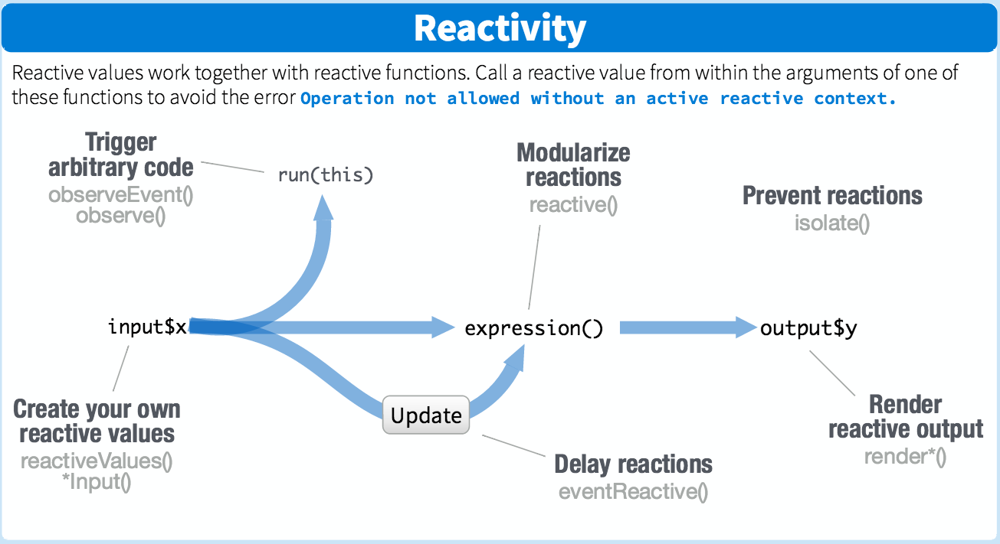

<style type="text/css">
.title-slide hgroup h1 p{
  font-size:65px;
}
slide article pre{
  font-size: medium;
  line-height: 1;
}
.large{
  .font-size:large;
  line-height:1;
}
.bigger{
  font-size:xx-large;
  line-height:1;
}
.smallslide{
  font-size:medium;
  line-height:1;
}
</style>

```{r echo= FALSE, warning=FALSE, message=FALSE}
library(shinyngs)
data('zhangneurons')
```

## Outline {.bigger}

1. Shiny basics
2. Reactivity
3. Application layout
4. Advanced UI
5. Fancy tables and plots
5. Modules
6. Example app

# Shiny basics

## What is Shiny? {.bigger}

* Web application framework for R
* Integration with popular javascript libraries
    * Datatables
    * Plotly
    * Bootstrap
    * Selectize
* Excellent documentation at http://shiny.rstudio.com/articles/

<div style="position:absolute;bottom:4%;left:5%;width:450px;font-size:11pt;">http://shiny.rstudio.com/</div>

## Parts of a shiny app {.large}

* A `ui` element to provide:
    * controls:
        * `selectInput()`
        * `textInput()`
    * output placeholders:
        * `plotOutput()`
        * `plotly::plotlyOutput()`
        * `DT::dataTableOutput()`
    
* A `server` element to run the code, based on `ui`:
    * `renderPlot()`
    * `plotly::renderPlotly()`
    * `DT::renderDataTable()`

## Hello Shiny (1)

```{r}
library(shiny)
ui <- fluidPage(

  titlePanel("Hello Shiny!"),
  
  sidebarLayout(
    sidebarPanel(
      sliderInput("bins",
                  "Number of bins:",
                  min = 1,
                  max = 50,
                  value = 30)
    ),
    mainPanel(
      plotOutput("distPlot") # <- NOTE: 'distPlot' placeholder set here 
    )
  )
)
server <- function(input, output) {
  
  output$distPlot <- renderPlot({ # NOTE: 'distPlot' placeholder filled here
    x    <- faithful[, 2]  # Old Faithful Geyser data
    bins <- seq(min(x), max(x), length.out = input$bins + 1)
    hist(x, breaks = bins, col = 'darkgray', border = 'white')
  })
}
```

<div style="position:absolute;bottom:4%;left:5%;width:450px;font-size:11pt;">http://shiny.rstudio.com/articles/basics.html</div>

## Hello Shiny (2)

```{r}
shinyApp(ui, server, options = list(height = 500))
```

<div style="position:absolute;bottom:4%;left:5%;width:450px;font-size:11pt;">http://shiny.rstudio.com/articles/basics.html</div>

# Reactivity

## Overview


* Form inputs are reactive 'sources'
* Anything that uses the inputs is a reactive 'endpoint'
* Simply using a field in `input` links the input to the endpoint
* Reactive 'conductors' (aka 'reactive expressions') between source and endpoint 
* Reactive expressions can be passed around

<div class="notes">
- reactive expressions used to cache results and prevent recomputation
- passing reactives around useful for communicating between modules
</div>

<div style="position:absolute;bottom:4%;left:5%;width:450px;font-size:11pt;">http://shiny.rstudio.com/articles/reactivity-overview.html</div>

## Reactivity (2)


<div style="position:absolute;bottom:4%;left:5%;width:450px;font-size:11pt;">http://www.rstudio.com/wp-content/uploads/2016/01/shiny-cheatsheet.pdf</div>

## Reactive expressions {.smallslide}

Minimise use of time-consuming 'normal' functions like: 

```{r, eval=FALSE}
getResults <- function(input){
   myTimeConsumingFunction(input$obs)  
}
```

Reactive functions only recompute results where the reactive 'source' in `input` changes:

```{r, eval=FALSE}
getResults <- reactive({
  myTimeConsumingFunction(input$obs)  
})
```

Sometimes we want to parse `input` without updating the endpoint. This is what `isolate()` is for:

```{r, eval=FALSE}
getResults <- reactive({
  doSomethingWithObsThatDoesntRequireAPlotUpdate(isolate(input$obs))  
})
```


# Application layout

## Layout: general

* Lots of options here:
    * Low-level functions:
        * `fluidRow()`
        * `column()`
        * `wellPanel()`
        * ...
    * High-level functions:
        * Simple sidebar + main panel: `sidebarLayout()`
        * Multiple output tabs: `tabsetPanel()`, `navlistPanel()`
        * Full-on complex apps: `navbarPage()`, `navbarMenu()`
      
<div style="position:absolute;bottom:4%;left:5%;width:450px;font-size:11pt;">http://shiny.rstudio.com/articles/layout-guide.html</div>

## sidebarLayout(): code

```{r}
library(shiny)
ui <- fluidPage(

  titlePanel("Hello Shiny!"),
  
  sidebarLayout(
    sidebarPanel(
      sliderInput("bins",
                  "Number of bins:",
                  min = 1,
                  max = 50,
                  value = 30)
    ),
    mainPanel(
      plotOutput("distPlot") # <- NOTE: 'distPlot' placeholder set here 
    )
  )
)
```

(server function hidden for clarity)

<div style="position:absolute;bottom:4%;left:5%;width:450px;font-size:11pt;">http://shiny.rstudio.com/articles/layout-guide.html</div>

## sidebarLayout(): display

```{r, echo=FALSE}
shinyApp(ui=ui, server=server)
```

<div style="position:absolute;bottom:4%;left:5%;width:450px;font-size:11pt;">http://shiny.rstudio.com/articles/layout-guide.html</div>

## `tabsetPanel()`: code

```{r}
ui <- fluidPage(

  titlePanel("Tabsets"),

  sidebarLayout(
    
    sidebarPanel(
      sliderInput("bins",
                  "Number of bins:",
                  min = 1,
                  max = 50,
                  value = 30)
    ),
  
    mainPanel(
      tabsetPanel(
        tabPanel("Plot", plotOutput("distPlot")), 
        tabPanel("Summary", verbatimTextOutput("summary")), 
        tabPanel("Table", tableOutput("table"))
      )
    )
  )
)
```

<div style="position:absolute;bottom:4%;left:5%;width:450px;font-size:11pt;">http://shiny.rstudio.com/articles/layout-guide.html</div>

## `tabsetPanel()`: display
```{r echo = FALSE}
shinyApp(ui=ui, server=server)
```

<div style="position:absolute;bottom:4%;left:5%;width:450px;font-size:11pt;">http://shiny.rstudio.com/articles/layout-guide.html</div>

## More complex apps

```{r}
ui <- navbarPage("My Application",
  tabPanel("Component 1"),
  tabPanel("Component 2"),
  navbarMenu("More",
    tabPanel("Sub-Component A"),
    tabPanel("Sub-Component B"))
)
```

... and you get: 

```{r echo = FALSE}
shinyApp(ui = ui, server = server)
```

<div style="position:absolute;bottom:4%;left:5%;width:450px;font-size:11pt;">http://shiny.rstudio.com/articles/layout-guide.html</div>

## Shiny themes: cosmo

If you install `shinythemes` you can do things like:

```{r}
ui_cosmo <- fluidPage(theme = shinythemes::shinytheme("cosmo"), ui)
```

```{r echo = FALSE}
shinyApp(ui = ui_cosmo, server = server)
```

<div style="position:absolute;bottom:4%;left:5%;width:450px;font-size:11pt;"https://rstudio.github.io/shinythemes/</div>

## Shiny themes: united

```{r}
ui_united <- fluidPage(theme = shinythemes::shinytheme("united"), ui)
```

```{r echo = FALSE}
shinyApp(ui = ui_united, server = server)
```

<div style="position:absolute;bottom:4%;left:5%;width:450px;font-size:11pt;"https://rstudio.github.io/shinythemes/</div>


# Advanced UI

## `uiOutput()` / `renderUI()` (1) {.smallslide}

```{r, echo=FALSE}
ui <- fluidPage(
  titlePanel("Dynamically generated user interface components"),
  fluidRow(

    column(3, wellPanel(
      selectInput("input_type", "Input type",
        c("slider", "numeric", "checkbox")
      )
    )),

    column(3, wellPanel(
      uiOutput("ui")
    )),

    column(3,
      tags$p("Input type:"),
      verbatimTextOutput("input_type_text"),
      tags$p("Dynamic input value:"),
      verbatimTextOutput("dynamic_value")
    )
  )
)
```

We can make UI elements whose composition depends on the settings of other UI elements. 

Put a placeholder `uiOutput("ui")` in the UI code, and use `renderUI()` in the server:

```{r}
server <- function(input, output) {

  output$ui <- renderUI({
    if (is.null(input$input_type))
      return()
    
    switch(input$input_type,
      "slider" = sliderInput("dynamic", "Dynamic",
                             min = 1, max = 20, value = 10),
      "text" = textInput("dynamic", "Dynamic",
                         value = "starting value"),
      "checkbox" = checkboxInput("dynamic", "Dynamic",
                                 value = TRUE)
    )
  })

  output$input_type_text <- renderText({
    input$input_type
  })

  output$dynamic_value <- renderPrint({
    str(input$dynamic)
  })

}
```

<div style="position:absolute;bottom:4%;left:5%;width:450px;font-size:11pt;">http://shiny.rstudio.com/gallery/dynamic-ui.html</div>

## `uiOutput()` / `renderUI()` (2)

```{r, echo = FALSE}
shinyApp(ui,server)
```
<div style="position:absolute;bottom:4%;left:5%;width:450px;font-size:11pt;">http://shiny.rstudio.com/gallery/dynamic-ui.html</div>


## Server-side `selectizeInput()`: code {.smallslide}

```{r echo = FALSE}
ese <- zhangneurons[[1]]
named_gene_list <- structure(rownames(ese), names = data.frame(SummarizedExperiment::mcols(ese))[, 'external_gene_name'])
expression_matrix <- SummarizedExperiment::assays(ese)[[1]]
sample_info <- SummarizedExperiment::colData(ese)
```

```{r}
ui <- fluidPage(
  sidebarLayout(
    sidebarPanel = list(
      selectizeInput("gene_label", "Gene label", choices = NULL, 
                     options = list(placeholder = "Type a gene label", maxItems = 5)) 
    ),
    mainPanel = list(plotly::plotlyOutput("barPlot", height = 300)    )
  )
)

server <- function(input, output, session){
    # Using a gene list from some example data
    getGeneNames <- reactive({
      named_gene_list
    })
    
    # Create reactive context using observe()
    observe({
        updateSelectizeInput(session, "gene_label", choices = getGeneNames(), server = TRUE)
    })
    
    output$barPlot <- renderPlotly({
        validate(need(!is.null(input$gene_label), "Waiting for a gene input"))
        barplot_expression <- expression_matrix[input$gene_label, , drop = FALSE]
        shinyngs:::geneBarplot(barplot_expression, sample_info, 'cell_type', "expression")
    })
}
```

## Server-side `selectizeInput()`: result

Server-side handling of options list makes it fast:

```{r echo = FALSE}
shinyApp(ui = ui, server = server)
```
<div style="position:absolute;bottom:4%;left:5%;width:450px;font-size:11pt;">https://github.com/selectize/selectize.js</div>

## shinyBS

* Handy extra bits of interactivity from Bootstrap (Twitter)
* Useful for making controls hideable

```{r}
ui <- fluidPage(

  titlePanel("Hello Shiny!"),
  
  sidebarLayout(
    sidebarPanel(
      shinyBS::bsCollapsePanel(
        'My collapsible panel',
        value = 'value',
        sliderInput("bins",
          "Number of bins:",
          min = 1,
          max = 50,
          value = 30
        )
      )
    ),
    mainPanel(
      plotOutput("distPlot") # <- NOTE: 'distPlot' placeholder set here 
    )
  )
)
```

```{r echo = FALSE}
server <- function(input, output) {
  
  output$distPlot <- renderPlot({ # NOTE: 'distPlot' placeholder filled here
    x    <- faithful[, 2]  # Old Faithful Geyser data
    bins <- seq(min(x), max(x), length.out = input$bins + 1)
    hist(x, breaks = bins, col = 'darkgray', border = 'white')
  })
}
```

## shinyBS output

```{r echo = FALSE}
shinyApp(ui = ui, server = server)
```

* Gotcha: Shiny will ignore hidden inputs, so you might not want to hide things by default.

## Checking inputs are available: `validate()` and `need()`

Sometimes takes a second for fields to render, so we need outputs to wait for input values:

```{r eval = TRUE}

# in ui.R
ui <- fluidPage(
  checkboxGroupInput('in1', 'Check some letters', choices = head(LETTERS)),
  selectizeInput('in2', 'Select a state', choices = state.name),
  plotOutput('plot', height = '200px')
)

# in server.R
server <- function(input, output) {
  output$plot <- renderPlot({
    validate(
      need(input$in1, 'Check at least one letter!'),
      need(input$in2 != '', 'Please choose a state.')
    )
    plot(1:10, main = paste(c(input$in1, input$in2), collapse = ', '))
  })
}
```

## `validate()` and `need()`

```{r echo = FALSE}
shinyApp(ui = ui, server = server)
```

## Long-running processes: `withProgress()`

Keep the user up-to-date with what's going on:

```{r eval = FALSE}
server <- function(input, output) {
  
  output$plot <- renderPlot({
    withProgress(message = 'Calculation in progress',
                 detail = 'This may take a while...', value = 0, {
      for (i in 1:15) {
        incProgress(1/15)
        Sys.sleep(0.25)
      }
    })
    plot(cars)
  })
}
```


# Fancy tables and plots

## Tabular output with DataTables (1)

```{r}
suppressMessages(library(DT))

ui <- fluidPage(
  verticalLayout(
    titlePanel('Motor Trend Car Road Tests'),
    DT::dataTableOutput('mtcars')    
  )  
)
server <- function(input, output){
  output$mtcars <- DT::renderDataTable(
    mtcars, 
    options = list(
      pageLength = 5
    )
  )  
}
```

<div style="position:absolute;bottom:4%;left:5%;width:450px;font-size:11pt;">https://rstudio.github.io/DT/shiny.html</div>

## Tabular output with DataTables (2)

```{r, echo = FALSE}
shinyApp(ui=ui, server=server)
```

## Interactive with plotly (1) {.smallslide}

```{r}
suppressMessages(library(plotly))
ui <- fluidPage(
  sidebarLayout(
    sidebarPanel(
      selectInput('x', 'X axis', colnames(mtcars), selected='mpg'),
      selectInput('y', 'Y axis', colnames(mtcars), selected='cyl'),
      selectInput('z', 'Z axis', colnames(mtcars), selected='qsec'),
      selectInput('color', 'Color by', colnames(mtcars), selected='gear')
    ),
    mainPanel(
      plotlyOutput("mtcars", height=500)
    )
  )
)
server <- function(input, output) {
  output$mtcars <- renderPlotly(
      plot_ly(
      mtcars, 
      x=mtcars[,input$x], 
      y=mtcars[,input$y], 
      z=mtcars[,input$z], 
      color=factor(mtcars[,input$color]), 
      text=rownames(mtcars), 
      hoverinfo='text', 
      type='scatter3d', 
      mode='markers'
    )
  )
}
```

<div style="position:absolute;bottom:4%;left:5%;width:450px;font-size:11pt;">https://plot.ly/r/shiny-tutorial/</div>

## Interactive with plotly (2)

```{r, echo=FALSE}
shinyApp(ui=ui, server=server)
```

# Shiny modules

## Re-usability of Shiny components: the problem

* Shiny apps can rapidly become quite complex:
    * Multiple panels with similar controls but different outputs
    * All controls share global namespace
    * Re-using code for UI components using functions is fiddly
* Solution: modules
    * 'OO Shiny'
    
## Module pattern:
    
The module:

```{r eval = FALSE}
# Module UI component
mymoduleInput <- function(id){
  ns <- NS(id) # create a function for bringing field IDs into the module namespace
  list(selectInput(ns('myinput'), 'My Input', choices = c('one', 'two'))) 
}
# Module server component
mymodule <- function(input, output, session){
  # process outputs etc
}
```

From the application that uses the module:

```{r eval = FALSE}
ui <- fixedPage(
  mymoduleInput('mything') 
)
server <- function(input, output){
  callModule(mymodule, 'mything') 
}
```
    
## Shiny's example: linked scatter plots module {.smallslide}

```{r}
library(ggplot2)

linkedScatterUI <- function(id) {
  ns <- NS(id)
  fluidRow(
    column(6, plotOutput(ns("plot1"), brush = ns("brush"))),
    column(6, plotOutput(ns("plot2"), brush = ns("brush")))
  )
}

linkedScatter <- function(input, output, session, data, left, right) {
  # Yields the data frame with an additional column "selected_"
  # that indicates whether that observation is brushed
  dataWithSelection <- reactive({brushedPoints(data(), input$brush, allRows = TRUE) })
  output$plot1 <- renderPlot({scatterPlot(dataWithSelection(), left())})
  output$plot2 <- renderPlot({scatterPlot(dataWithSelection(), right())  })
  return(dataWithSelection)
}

scatterPlot <- function(data, cols) {
  ggplot(data, aes_string(x = cols[1], y = cols[2])) +
    geom_point(aes(color = selected_)) +
    scale_color_manual(values = c("black", "#66D65C"), guide = FALSE)
}

```

## Shiny's example: linked scatter plots app {.smallslide}    

```{r}
ui <- fixedPage(
  h2("Module example"),
  linkedScatterUI("scatters"),
  textOutput("summary")
)

server <- function(input, output, session) {
  df <- callModule(linkedScatter, "scatters", reactive(mpg),
    left = reactive(c("cty", "hwy")),
    right = reactive(c("drv", "hwy"))
  )

  output$summary <- renderText({
    sprintf("%d observation(s) selected", nrow(dplyr::filter(df(), selected_)))
  })
}
```

## 
```{r echo = FALSE}
shinyApp(ui, server)
```

<div style="position:absolute;bottom:4%;left:5%;width:450px;font-size:11pt;">http://shiny.rstudio.com/gallery/module-example.html</div>

## Less interesting example module: plot downloader (module) {.smallslide}

```{r eval = FALSE}

# UI component just defines a download button

plotdownloadInput <- function(id) {
    ns <- NS(id)
    downloadButton(ns("plotdownload"), "Download Plot")
}

# Server component uses a provided reactive to generate a plot for download

plotdownload <- function(input, output, session, makePlot, filename = "plot.png", plotHeight, plotWidth) {
    
    output$plotdownload <- downloadHandler(filename = filename, content = function(file) {
        print(paste0("Making output file of dimension ", plotWidth, "x", plotHeight))
        png(file, height = plotHeight, width = plotWidth, units = "px")
        print(makePlot())
        dev.off()
    })
} 

```

## Less interesting example module: app with download {.smallslide}

```{r eval = FALSE}

# Make a UI and include a download button

ui <- fixedPage(
  plotOutput("myscatter")
  plotdownloadInput("myscatter")
)

# Display the plot and call the module to make the download button work

server <- function(input, output){
  makeDisplayPlot <- reactive({...})
  makeDownloadPlot <- reactive({...})
  
  output$myscatter <- makeDisplayPlot(...)
  output$callModule(plotdownload, 'myscatter', makeDownloadPlot, 400, 600)
}
```

# Real world use-case

## Shinyngs

* Build apps for downstream interpretation of RNA-seq and other data
* See https://github.com/pinin4fjords/shinyngs for code and documentation

```{r eval= FALSE}
# Install the package

library(devtools)
install_github('pinin4fjords/shinyngs', ref='v0.1.2-alpha')

library(shinyngs)

# Load the example data

data("zhangneurons")

# Build the app with the example data

app <- prepareApp("rnaseq", zhangneurons)

# Run the app

shiny::shinyApp(app$ui, app$server)
```

* Now for a live demo...

# That's all folks

## Presentation brought to you by: {.bigger}

* Centre for Regenerative Medicine
* Rmarkdown + ioslides format http://rmarkdown.rstudio.com
* RStudio https://www.rstudio.com
* Shiny http://shiny.rstudio.com/

<div style="position:absolute;bottom:4%;left:5%;width:450px;font-size:11pt;">http://rmarkdown.rstudio.com/</div>


